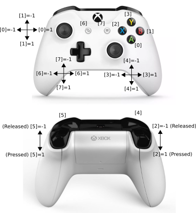

# Control device interface

This oroGen project provides data from control devices (e.g. joysticks,
joypads, ...) on Linux

The general data structure is `/controldev/RawCommand`, which provides analog
stick feedback in its `axisValue` array (between 0 and 1), and digital button
feedback in its `buttonValue` array (either 0 or 1).

Any USB device supported by Linux's input device drivers is supported.

## Xbox One Controller (JoystickTask)

deviceIdentifier: Microsoft X-Box One S pad

